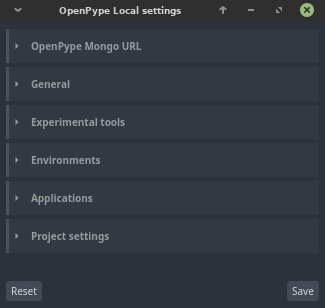

import Tabs from '@theme/Tabs';
import TabItem from '@theme/TabItem';

OpenPype stores some of it's settings and configuration in local file system. These settings are specific to each individual machine and provides the mechanism for local overrides

**Local Settings** GUI can be started from the tray menu.

## Categories

### OpenPype Mongo URL
The **Mongo URL** is the database URL given by your Studio. More details [here](artist_getting_started#mongodb).

 

### General
**OpenPype Username** : enter your username (it can also take by default the computer session username). It signs your actions on **OpenPype**.

 

**Admin permissions** : on checked, no need to enter a password (if defined) to access to the **Admin** section.

 

### Experimental tools
Futur version of existing tools or new ones.

 

### Environments
Local replacement of the environment data of each software and additional internal data necessary to be loaded correctly.

 

### Applications
Local override of software paths and their versions. More details [here](admin_settings_system/#applications).

 

### Project Settings
The **Project Settings** allows to determine the root folder. More details [here](module_site_sync/#local-settings).
