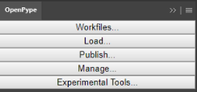
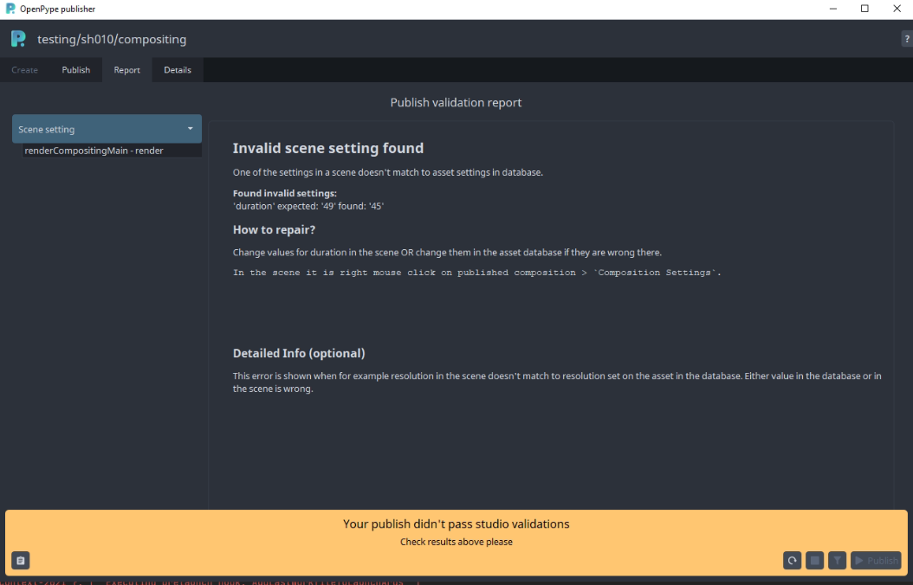
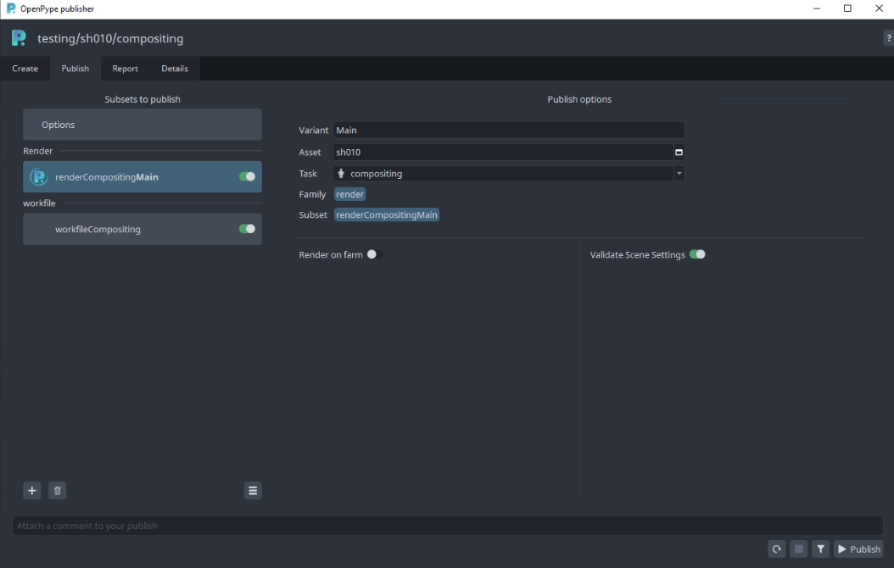

<!-- based on PS implementation, same principle and menu -->
## Available Tools

-   [Work Files](artist_tools_workfiles)
-   [Create](artist_tools_creator)
-   [Load](artist_tools_loader)
-   [Publish](artist_tools_publisher)
-   [Manage](artist_tools_inventory)
-   [Subset Manager](artist_tools_subset_manager)

## Setup

To install the extension, download, install [Anastasyi's Extension Manager](https://install.anastasiy.com/). Open Anastasyi's Extension Manager and select AfterEffects in menu. Then go to `{path to pype}hosts/aftereffects/api/extension.zxp`.

Drag extension.zxp and drop it to Anastasyi's Extension Manager. The extension will install itself.

## Implemented functionality

AfterEffects implementation currently allows you to import and add various media to composition (image plates, renders, audio files, video files etc.)
and send prepared composition for rendering to Deadline or render locally.

## Usage

When you launch AfterEffects you will be met with the Workfiles app. If don't
have any previous workfiles, you can just close this window.

Workfiles tools takes care of saving your .AEP files in the correct location and under
a correct name. You should use it instead of standard file saving dialog.

In AfterEffects you'll find the tools in the `OpenPype` extension:

 <!-- same menu as in PS -->

You can show the extension panel by going to `Window` > `Extensions` > `OpenPype`.

### Publish

When you are ready to share some work, you will need to publish it. This is done by opening the `Publisher` through the `Publish...` button.

There is always instance for workfile created automatically (see 'workfileCompositing' item in `Subsets to publish` column.) This allows to publish (and therefore backup)
workfile which is used to produce another publishable elements (as `image` and `review` items).

Main publishable item in AfterEffects will be of `render` family. Result of this item (instance) is picture sequence that could be a final delivery product or loaded and used in another DCCs.

First select existing composition and then press `Create >>>` in middle column of `Publisher`.

After this process you should have something like this:

Name of publishable instance (eg. subset name) could be configured with a template in `project_settings/global/tools/creator/subset_name_profiles`.
(This must be configured by admin who has access to Openpype Settings.)

Trash icon under the list of instances allows to delete any selected `render` instance.

Workfile instance will be automatically recreated though. If you do not want to publish it, use pill toggle on the instance item.

If you would like to modify publishable instance, click on `Publish` tab at the top. This would allow you to change name of publishable
instances, disable them from publishing, change their task etc.

Publisher allows publishing into different context, just click on any instance, update `Variant`, `Asset` or `Task` in the form in the middle and don't forget to click on the 'Confirm' button.

#### RenderQueue

AE's Render Queue is required for publishing locally or on a farm. Artist needs to configure expected result format (extension, resolution) in the Render Queue in an Output module.
Currently its expected to have only single render item per composition in the Render Queue.

AE might throw some warning windows during publishing locally, so please pay attention to them in a case publishing seems to be stuck in a `Extract Local Render`.

#### Repair Validation Issues

If you would like to run validation rules set by your Studio, click on funnel icon at the bottom right. This will run through all
enabled instances, you could see more information after clicking on `Details` tab.

If there is some issue in validator phase, you will receive something like this:

All validators will give some description about what the issue is. You can inspect this by clicking on items in the left column.

If there is an option of automatic repair, there will be `Repair` button on the right. In other case you need to fix the issue manually.
(By deleting and recreating instance, changing workfile setting etc.)

#### Render instance options

There are currently 2 options of `render` item:
- Render of farm - allows offload rendering and publishing to Deadline - requires Deadline module being enabled
- Validate Scene Settings - enables validation plugin which controls setting in DB (or asset control system like Ftrack) and scene itself

#### Buttons on the bottom right are for:
- `Refresh publishing` - set publishing process to starting position - useful if previous publish failed, or you changed configuration of a publish
- `Stop/pause publishing` - if you would like to pause publishing process at any time
- `Validate` - if you would like to run only collecting and validating phases (nothing will be published yet)
- `Publish` - standard way how to kick off full publishing process

#### Support help
If you would like to ask for help admin or support, you could use any of the three options on the `Note` button on bottom left:
- `Go to details` - switches into a more detailed list of published instances and plugins.
- `Copy report` - stash full publishing log to a clipboard
- `Export report` - save log into a file for sending it via mail or any communication tool

If you are able to fix the workfile yourself, use the first button on the right to set the UI to initial state before publish. (Click the `Publish` button to start again.)

#### Legacy instances

All screenshots from Publish are from updated dialog, before publishing was being done by regular `Pyblish` tool.
New publishing process should be backward compatible, eg. if you have a workfile with instances created in the previous publishing approach, they will be translated automatically and
could be used right away.

If you hit on unexpected behaviour with old instances, contact support first, then you could try to delete and recreate instances from scratch.
Nuclear option is to purge workfile metadata in `Window > Metadata > Basic > Label`. This is only for most determined daredevils though!

### Load

When you want to load existing published work, you can use the `Loader` tool. You can reach it in the extension's panel.

 <!-- picture needs to be changed -->

The supported families for loading into AfterEffects are:

- `image`
- `plate`
- `render`
- `prerender`
- `review`
- `audio`
- `background` `(set of images sorted in predefined order)`

To load an item, right-click on the subset you want and choose a representation you want to load:

### Manage

Now that we have some content loaded, you can manage which version is loaded. This is done through the `Scene Manager`. You can reach it through the extension's `Manage` button.

:::note
Loaded images have to stay as smart layers in order to be updated. If you rasterize the layer, you can no longer update it to a different version using OpenPype tools.
:::

You can switch to a previous version of the image or update to the latest.

